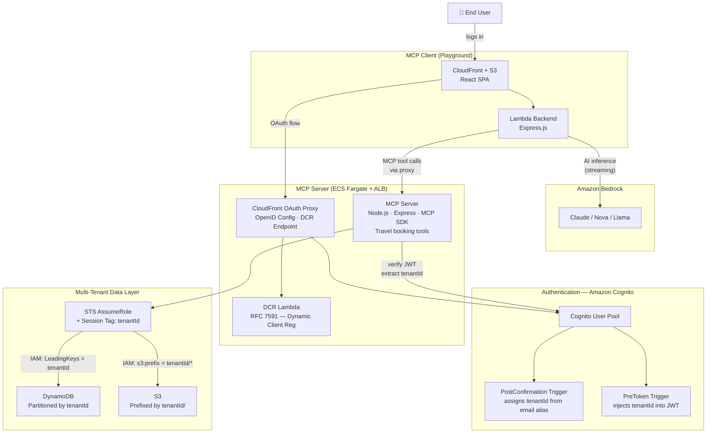
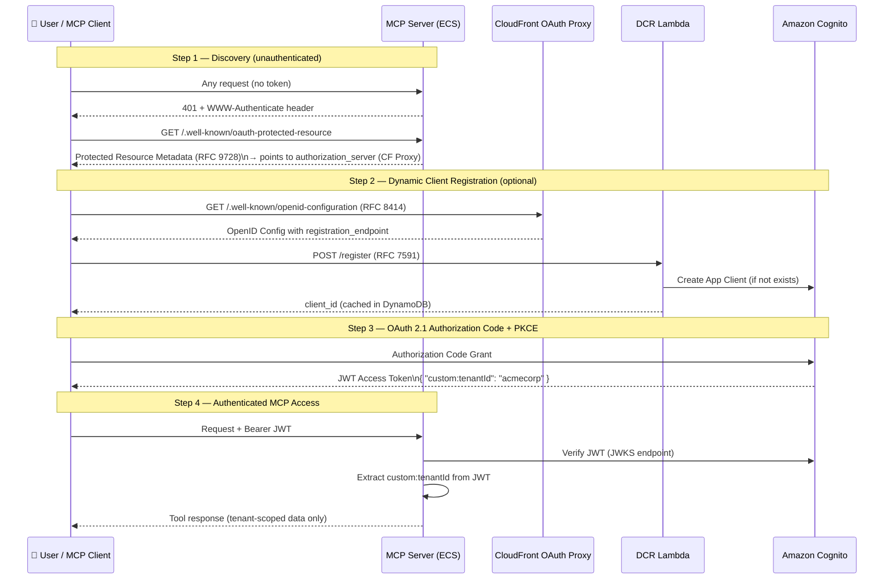
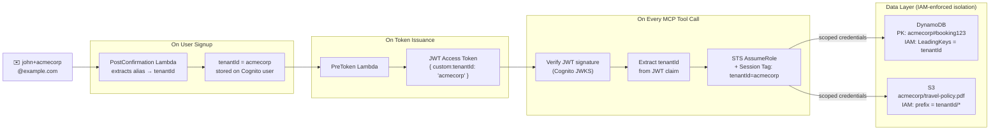

# Architecture Overview — Multi-Tenant SaaS MCP Server

> Use a Mermaid-compatible viewer to render these diagrams (VS Code + Mermaid extension, GitHub, Notion, etc.)

---

## 1. High-Level System Architecture

---

## 2. Authentication & Authorization Flow

---

## 3. Multi-Tenant Data Isolation

How a single shared infrastructure serves multiple tenants with zero data bleed — enforced by IAM, not application code.

---

## Key Design Decisions (talking points)

| Decision | Why |
|---|---|
| **Tenant ID via email alias** | Simple demo mechanism — not for production (no ownership validation) |
| **STS session tagging** | Tenant isolation enforced by IAM policies, not app code — more secure |
| **Custom DCR Lambda** | Cognito doesn't support RFC 7591 natively — Lambda + DynamoDB fills the gap |
| **CloudFront OAuth proxy** | Cognito's built-in OpenID endpoint can't be customized; proxy adds `registration_endpoint` |
| **ECS Fargate for MCP Server** | MCP uses persistent HTTP (Streamable HTTP transport), not ideal for Lambda |
| **JWT in-memory only (client)** | Tokens never written to localStorage — reduces XSS attack surface |
