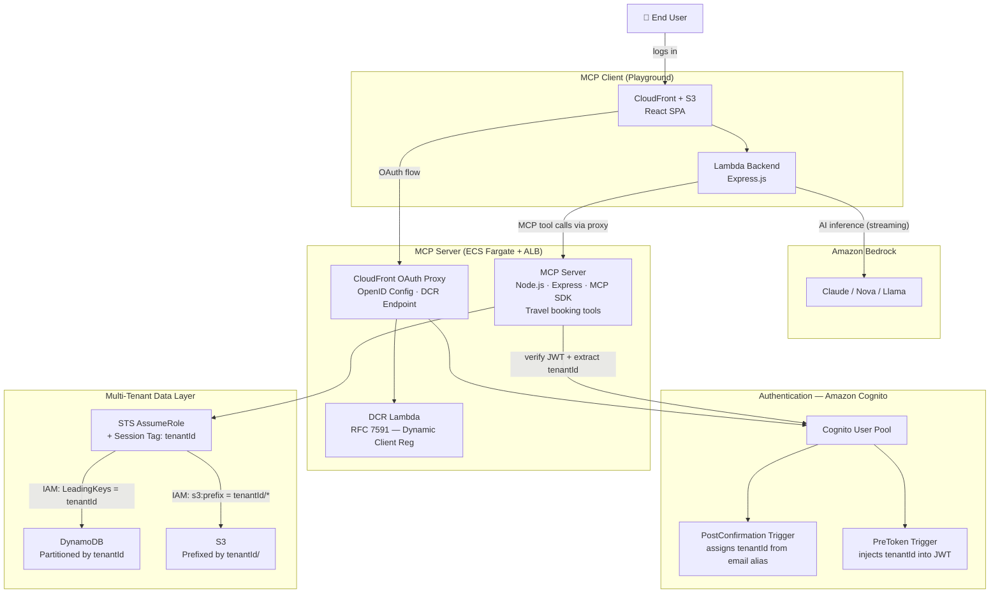
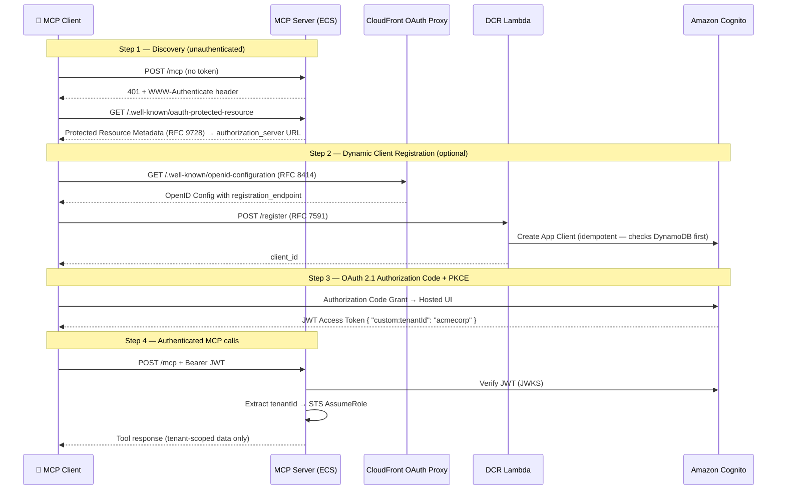
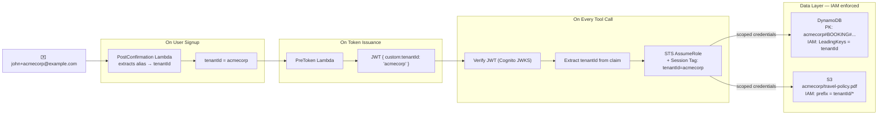

# Multi-Tenant SaaS MCP Server — Complete Guide

A production-ready reference implementation of a **multi-tenant SaaS platform built on the Model Context Protocol (MCP)**. It ships two independently deployable pieces: an MCP Server (the backend, with travel booking tools) and an MCP Client Playground (a React + Amazon Bedrock frontend). Both are AWS-native and deployable with a single script.

---

## Table of Contents

1. [What This Repo Is](#1-what-this-repo-is)
2. [High-Level Architecture](#2-high-level-architecture)
3. [MCP Server](#3-mcp-server)
   - [Authentication Flow](#31-authentication-flow)
   - [Multi-Tenancy — 4 Layers of Isolation](#32-multi-tenancy--4-layers-of-isolation)
   - [Available Tools, Resources & Prompts](#33-available-tools-resources--prompts)
   - [Deployment](#34-deployment)
   - [Local Development](#35-local-development)
4. [MCP Client Playground](#4-mcp-client-playground)
   - [Features](#41-features)
   - [Connecting MCP Servers](#42-connecting-mcp-servers)
   - [Deployment](#43-deployment)
   - [User Management](#44-user-management)
5. [End-to-End Request Lifecycle](#5-end-to-end-request-lifecycle)
6. [Connecting External MCP Servers](#6-connecting-external-mcp-servers)
7. [Key Design Decisions](#7-key-design-decisions)
8. [Security Considerations](#8-security-considerations)
9. [Project Structure](#9-project-structure)
10. [Disclaimer](#10-disclaimer)

---

## 1. What This Repo Is

This repository demonstrates how to build and deploy a **remote, multi-tenant MCP server** that:

- Authenticates users via **OAuth 2.1 with PKCE** (no API keys, no shared secrets)
- Enforces **tenant-level data isolation** using AWS IAM — not application-level guards
- Supports **Dynamic Client Registration (RFC 7591)** so MCP clients (Claude Desktop, Inspector, custom clients) self-register without manual setup
- Provides a **full-featured MCP client** (React SPA + Lambda) backed by Amazon Bedrock that can connect to any MCP server

**Use it as a reference when building your own multi-tenant MCP-powered service.**

---

## 2. High-Level Architecture



**Two independently deployable stacks:**

| Component | Hosting | Purpose |
|---|---|---|
| `mcp_server/` | ECS Fargate + ALB + CloudFront | MCP protocol server — tools, resources, prompts |
| `mcp_client/` | CloudFront + S3 + API Gateway + Lambda | React SPA + Bedrock inference + MCP proxy |

---

## 3. MCP Server

A **Node.js + Express** server implementing the MCP Streamable HTTP transport. It exposes travel booking tools and enforces per-tenant data isolation on every request.

### 3.1 Authentication Flow



**Why CloudFront in front of the OAuth flow?**
Amazon Cognito's built-in `/.well-known/openid-configuration` endpoint cannot be customized to add a `registration_endpoint`. The CloudFront proxy intercepts that path and returns a custom document with the DCR Lambda URL injected — leaving all other Cognito endpoints untouched.

**Why Dynamic Client Registration?**
MCP clients (Claude Desktop, Inspector, this playground) need a `client_id` to start OAuth. DCR (RFC 7591) lets them self-register without an admin creating app clients manually. The DCR Lambda is idempotent — same `client_name + redirect_uri` always returns the same `client_id`.

### 3.2 Multi-Tenancy — 4 Layers of Isolation



**Layer 1 — Tenant assignment at signup**
The Cognito `PostConfirmation` Lambda reads the `+alias` from the user's email (`john+acmecorp@example.com` → `tenantId = acmecorp`) and stores it as a custom Cognito attribute.

**Layer 2 — Tenant ID injected into every JWT**
The `PreToken` Lambda adds `custom:tenantId` to every access token at issuance time. The application never trusts a client-provided tenant claim.

**Layer 3 — JWT verification + extraction on the MCP server**
Every request to `/mcp` passes through `requireBearerAuth` middleware. The server verifies the JWT against Cognito's JWKS endpoint and extracts `custom:tenantId`. Requests with no token or an invalid token are rejected with 401 before any tool logic runs.

**Layer 4 — IAM-enforced data isolation (the strongest layer)**
Rather than writing `WHERE tenantId = X` in application code, the server calls `STS AssumeRole` with a session tag `tenantId=acmecorp`. The IAM role's policy uses:

```json
"Condition": {
  "ForAllValues:StringEquals": {
    "dynamodb:LeadingKeys": ["${aws:PrincipalTag/tenantId}"]
  }
}
```

This means **AWS itself** rejects any DynamoDB read or write where the partition key doesn't start with the caller's `tenantId`. Even if the application code had a bug, the AWS policy would block the cross-tenant access.

The S3 equivalent:
```json
"Condition": {
  "StringLike": {
    "s3:prefix": ["${aws:PrincipalTag/tenantId}/*"]
  }
}
```

### 3.3 Available Tools, Resources & Prompts

| Tool | Description |
|---|---|
| `whoami` | Current user info and tenant context |
| `listFlights` | Search available flights |
| `bookFlight` | Book a flight (writes to DynamoDB under tenant partition) |
| `listHotels` | Search available hotels |
| `bookHotel` | Book a hotel room |
| `modifyHotelBooking` | Modify an existing hotel booking |
| `listBookings` | View all bookings for the caller's tenant only |
| `getLoyaltyProgramInfo` | Loyalty program details |

**Resources** — Travel policy PDFs stored in S3 under `{tenantId}/` prefix, surfaced as MCP resources.

**Prompts** — Pre-built prompt templates for common travel booking scenarios.

### 3.4 Deployment

The MCP server uses a two-stack CDK deployment:

- **Infrastructure Stack** — DynamoDB table, S3 bucket, Cognito User Pool, IAM roles, Lambda triggers (PostConfirmation, PreToken), DCR Lambda
- **Application Stack** — ECS Fargate cluster, Application Load Balancer, VPC, CloudFront distribution

```bash
cd mcp_server/infra
npm install
./deploy.sh
```

> ECS Fargate is used (not Lambda) because MCP's Streamable HTTP transport requires persistent connections — Lambda's stateless invocation model doesn't fit cleanly.

### 3.5 Local Development

```bash
# 1. Deploy infra only (creates Cognito, DynamoDB, S3, IAM)
cd mcp_server/infra
./deploy.sh --infrastructure-only

# 2. Set environment variables
cd ../src
cat > .env << EOF
TABLE_NAME=MCPServerTravelBookings
BUCKET_NAME=<from CFN outputs>
ROLE_ARN=<from CFN outputs>
COGNITO_USER_POOL_ID=<from CFN outputs>
AWS_REGION=us-east-1
EOF

# 3. Run locally
npm install && npm start

# 4. End-to-end test (against live deployment)
MCP_SERVER_URL=https://your-mcp-server.com \
TEST_USERNAME='user+acme@example.com' \
TEST_PASSWORD='YourPassword!' \
npm run test:e2e
```

---

## 4. MCP Client Playground

A **React + TypeScript SPA** that lets users:
- Sign in (Cognito-backed)
- Connect to any remote MCP server (this sample's server, or any third-party one)
- Chat with Amazon Bedrock models (Claude, Nova, Llama) using connected MCP tools
- Browse tools, resources, and prompts from connected servers

The frontend is served from **CloudFront + S3**. All API calls (Bedrock inference, MCP proxy) go through a **Lambda function** behind **API Gateway** — the browser never calls Bedrock or external MCP servers directly.

### 4.1 Features

- **Amazon Bedrock integration** — Claude 3/3.5 Haiku/Sonnet, Amazon Nova Lite/Micro/Pro, Llama 3.1/3.3 with real-time streaming
- **MCP server management** — connect multiple servers simultaneously
- **Three auth modes for MCP servers:**
  1. No auth (public servers)
  2. Manual Bearer Token (paste a token directly)
  3. OAuth flow (automated, opens in a new browser tab to avoid popup blockers)
  4. Pre-registered OAuth client (provide `client_id` + `client_secret`)
- **JWT tokens stored in memory only** — never written to `localStorage` or `sessionStorage`

### 4.2 Connecting MCP Servers

| Auth Method | When to Use |
|---|---|
| No auth | Public/local MCP servers |
| Manual Bearer Token | Servers that accept a static API key or PAT |
| OAuth flow | Servers implementing MCP OAuth (e.g., this sample's server) |
| Pre-registered client | When you already have a `client_id`/`client_secret` |

The client routes all MCP traffic through a **Lambda proxy** (`/api/mcp-proxy/{url}`). This avoids CORS issues and keeps credentials server-side.

### 4.3 Deployment

```bash
cd mcp_client

# Option 1 — Simple (CloudFront domain, no custom DNS)
./deploy.sh --simple

# Option 2 — Custom domain with Route53
./deploy.sh --custom-domain mcp.example.com \
  --hosted-zone-id Z1D633PJN98FT9 \
  --zone-name example.com \
  --cert-arn arn:aws:acm:us-east-1:123456789:certificate/abc123

# Option 3 — Custom domain with external DNS (Cloudflare, GoDaddy, etc.)
./deploy.sh --external-dns mcp.example.com \
  --cert-arn arn:aws:acm:us-east-1:123456789:certificate/abc123
```

After deployment, the script prints CloudFormation outputs. Copy the `export` commands it shows and create demo users:

```bash
export COGNITO_USER_POOL_ID=us-east-1_XXXXX
export COGNITO_CLIENT_ID=XXXXXXXXXX
export COGNITO_REGION=us-east-1
npm run users:demo
```

**CloudFront deployment layout:**

```
CloudFront Distribution
├── /* (default)     → S3 bucket (React SPA static files)
└── /api/*           → API Gateway → Lambda
    ├── /api/inference          Amazon Bedrock chat
    ├── /api/mcp-proxy/{url+}   Proxy to any MCP server
    └── /api/auth/*             Cognito token operations
```

### 4.4 User Management

```bash
# Create demo users
npm run users:demo

# Create a specific user
npm run users:create <username> <email> <password>

# List all users
npm run users:list

# Delete a user
npm run users:delete <username>
```

Demo credentials (created by `users:demo`):
- `demo` / `DemoPassword123!`
- `testuser` / `TestPassword123!`

---

## 5. End-to-End Request Lifecycle

Here is what happens from the moment a user sends a chat message in the playground until they see a Bedrock response with an MCP tool result:

```
Browser (React SPA)
  │
  ├─ POST /api/inference  ──────────────────────────────►  Lambda
  │   { model, messages, mcpServerUrl, bearerToken }          │
  │                                                           ├─► Amazon Bedrock (streaming)
  │                                                           │     Model decides to call a tool
  │                                                           │
  │                                                           ├─► POST /api/mcp-proxy/{mcpServerUrl}
  │                                                           │     (Lambda proxies to MCP server)
  │                                                           │         │
  │                                                           │         └─► MCP Server (ECS)
  │                                                           │               Verifies JWT
  │                                                           │               AssumeRole (tenantId)
  │                                                           │               Queries DynamoDB
  │                                                           │               Returns tool result
  │                                                           │
  │  ◄── streamed chunks ─────────────────────────────────────┤
  │                                                           │
  ▼
Browser renders streamed response
```

---

## 6. Connecting External MCP Servers

The playground can connect to **any** MCP server, not just the one in this repo. From the UI:

1. Enter the MCP server URL
2. Choose an auth method
3. Click Connect

**If the server uses OAuth** (like this sample), the playground auto-discovers OAuth metadata via `/.well-known/oauth-protected-resource`, registers a client via DCR if needed, and completes the Authorization Code + PKCE flow in a new tab.

**If the server uses a Bearer token** (e.g., Databricks Apps with a service principal OAuth M2M token), select Manual Bearer Token and paste the token. To generate one for Databricks:

```bash
# Exchange SP credentials for an access token
curl -X POST https://<workspace>.cloud.databricks.com/oidc/v1/token \
  -H "Content-Type: application/x-www-form-urlencoded" \
  -d "grant_type=client_credentials&client_id=<ID>&client_secret=<SECRET>&scope=all-apis"

# Use the returned access_token as the Bearer token in the playground
```

> Note: Databricks Apps use SSE transport (`/sse` endpoint), while this client uses Streamable HTTP (`POST /mcp`). For Databricks Apps, the service principal must also be added as a permitted user of the App in workspace settings.

---

## 7. Key Design Decisions

| Decision | Why |
|---|---|
| **Tenant ID via email alias** | Simple demo mechanism — `user+tenant@example.com`. Not for production (no ownership validation). |
| **STS session tagging for isolation** | Isolation enforced by AWS IAM, not application code. A bug in tool logic cannot leak cross-tenant data. |
| **Custom DCR Lambda** | Cognito doesn't support RFC 7591 natively. Lambda + DynamoDB fills the gap and caches registrations for sub-10ms lookups. |
| **CloudFront OAuth proxy** | Cognito's built-in OpenID endpoint can't be customized to add `registration_endpoint`. CloudFront intercepts and injects it. |
| **ECS Fargate for MCP Server** | MCP Streamable HTTP transport maintains persistent connections — Lambda's stateless model doesn't fit. |
| **Lambda proxy for MCP client** | Browser can't call external MCP servers directly (CORS). Lambda proxy relays calls server-side and keeps credentials out of the browser. |
| **JWT in-memory only** | Tokens never written to `localStorage` — reduces XSS attack surface. |
| **Two-stack CDK deployment** | Infrastructure stack (stateful: DynamoDB, S3, Cognito) is separated from application stack (stateless: ECS, ALB) so infra survives app redeployments. |

---

## 8. Security Considerations

### Production Readiness Gaps (this is a demo)

- **Tenant assignment is not validated.** Anyone can claim any tenant name by using `+tenantname` in their email alias. In production, use invitation flows or admin-controlled tenant assignment.
- **DCR endpoint is public.** RFC 7591 requires public DCR. A rate limit is applied, but public DCR always carries some abuse risk.
- **Config.ts hardcodes an API Gateway URL.** In production, use environment variables baked in at build time.

### What IS production-grade

- IAM-enforced data isolation (LeadingKeys + PrincipalTag) — cannot be bypassed at the application level
- JWT verification against Cognito JWKS on every request
- No secrets in the browser — all AWS credentials are in Lambda
- OAuth 2.1 + PKCE (no implicit flow, no client secrets in browser)
- Tokens stored in memory only

---

## 9. Project Structure

```
sample-multi-tenant-saas-mcp-server/
├── mcp_server/                  # MCP protocol server
│   ├── infra/                   # CDK stacks (Infrastructure + Application)
│   │   └── lambda/              # PostConfirmation, PreToken, DCR Lambdas
│   └── src/                     # MCP server application
│       ├── auth/                # JWT middleware, OAuth metadata
│       ├── tools/               # MCP tools (bookFlight, listHotels, etc.)
│       ├── resources/           # MCP resources (travel policies from S3)
│       ├── prompts/             # MCP prompts
│       ├── services/            # DynamoDB, S3 clients (with STS AssumeRole)
│       └── types/               # TypeScript types
│
├── mcp_client/                  # MCP client playground
│   ├── deploy/                  # CDK stack (CloudFront + S3 + API Gateway)
│   ├── src/
│   │   ├── components/          # React components
│   │   ├── hooks/               # useMcpConnection, useCognitoAuth
│   │   ├── lib/                 # Auth, config, constants
│   │   └── shared/              # Lambda-side code (mcp-proxy, inference)
│   └── deploy.sh                # Unified deployment script
│
└── resources/                   # Architecture diagrams (PNG)
```

---

## 10. Disclaimer

This repository is for **demonstration and reference purposes only**. It is not intended for production use without proper review, security hardening, and compliance validation — particularly around tenant assignment, DCR endpoint exposure, and credential management.

## Contributing

See [CONTRIBUTING](CONTRIBUTING.md) for more information.

## License

MIT-0 — See the [LICENSE](LICENSE) file.
